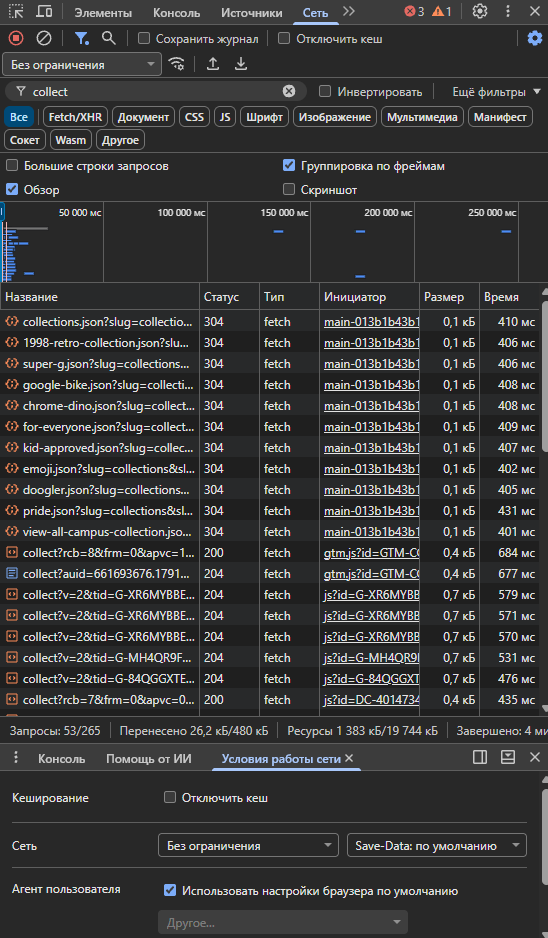

# Домашняя работа № 1 · Путь данных от ссылки до заявки

**Дисциплина:** ОП.03 «Информационные технологии»

| Поле | Значение |
|---|---|
| Фамилия, имя, отчество | Марущак Сергей Григорьевич |
| Группа | РПО25/2 |
| Номер работы | 1 |
| Тема работы | Цифровая воронка: путь данных от ссылки до заявки |
| Дата сдачи | 07.10 |
| Ветка | `hw-01` |

---

## Задание

1. Открыть сайт, панель разработчика (F12) → **Network**, в фильтре `collect`,
   галочка **Preserve log**.
2. Сделать три действия: обновить страницу, прокрутить до низа, нажать
   на товар. Записать, какие события ушли — параметр `en` на вкладке **Payload**.
3. Описать путь пользователя от ссылки до заявки, пять шагов.
4. Найти одно место на этом пути, где данные могут потеряться.
5. Приложить скриншоты `screens/01-network.png` и `screens/02-payload.png`.

Сайт: https://shop.merch.google/, запасные — https://habr.com/ru/,
https://www.smashingmagazine.com/, https://css-tricks.com/. Открывать
в Chrome или Edge с выключенным блокировщиком рекламы.

Срок — до начала занятия 2. Ветка `hw-01`, запрос на слияние в свою `main`.

---

## 1. Какой сайт смотрел

| Поле | Значение |
|---|---|
| Название сайта | google shop |
| Адрес | https://shop.merch.google/ |
| Откуда сайт | из списка в задании |

## 2. Три действия и что отправил счётчик

| № | Что я сделал на сайте | Название события (`en`) | Что ещё было в Payload |
|---|---|---|---|
| 1 | обновил страницу | `page_view` | `dl` — адрес страницы, `dt` — заголовок, `tid` — ID счётчика |
| 2 | прокрутил до низа | `scroll` | `epn.percent_scrolled` — процент прокрутки (90), `dl`, `tid` |
| 3 | нажал на товар | `select_item` | `items` — массив с данными товара (id, name, price), `dl`, `tid` |

Скриншоты:

## 3. Путь пользователя: 5 шагов

От ссылки до заявки, своими словами.

| № | Мой шаг | Пример |
|---|---|---|
| 1 | человек увидел рекламный пост в соцсети и кликнул по ссылке | *человек увидел ссылку в сообществе и нажал на неё* |
| 2 | открылась главная страница магазина | *открылась главная страница сайта* |
| 3 | пролистал каталог до формы записи / кнопки заявки | *он прокрутил до формы записи* |
| 4 | ввёл имя и номер телефона в поля | *начал заполнять: имя и телефон* |
| 5 | нажал «Отправить», заявка ушла менеджеру | *нажал «Отправить», заявка ушла менеджеру* |

## 4. Где данные могут потеряться

| № | На каком шаге | Что может потеряться |
|---|---|---|
| 1 | шаг 3, прокрутка страницы | событие `scroll` не срабатывает, если счётчик не настроен на 90% или блокируется блокировщиком рекламы |

## 5. Использование ИИ

| Вопрос | Ответ |
|---|---|
| Что сделал сам | Открыл DevTools, включил фильтр `collect` и Preserve log, выполнил три действия, нашёл параметр `en` в Payload, заполнил таблицы |
| Что спросил у модели | Как найти параметр `en` в запросах и какие события обычно соответствуют обновлению, скроллу и клику по товару |
| Что после этого изменил ||
